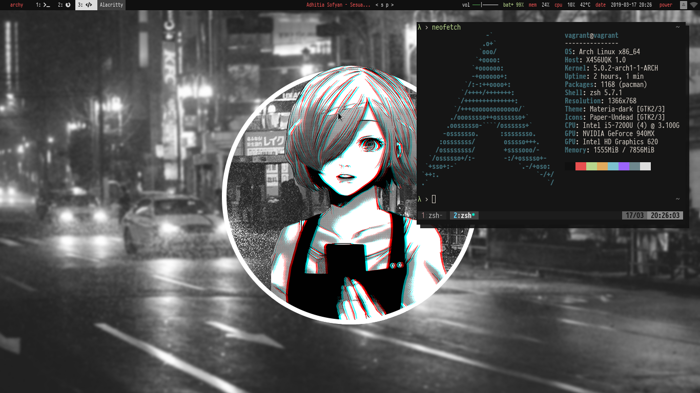
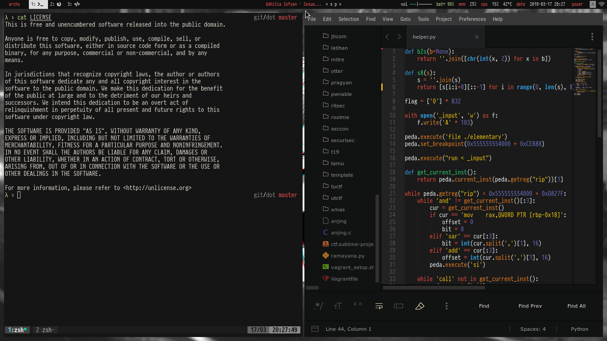

# dot
dotfiles for my current setup

## screenies



## how?
```sh
man stow
```

## links
- GTK+ Theme [materia-theme](https://github.com/nana-4/materia-theme)
- GTK+ Icons [paper-icons-undead](https://github.com/chrisduerr/paper-icons-undead)
